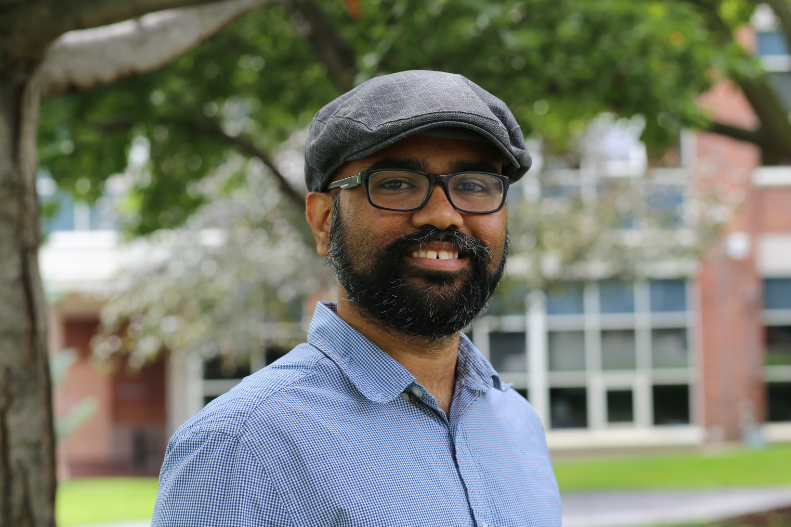

---
# You don't need to edit this file, it's empty on purpose.
# Edit theme's home layout instead if you wanna make some changes
# See: https://jekyllrb.com/docs/themes/#overriding-theme-defaults
layout: default_nofooter
---

## About

I am a Computational Physicist working in [Whitford Research Group](https://web.northeastern.edu/whitford/) at Northeastern University. I implement statistical physics tools to identify the physical principles that guide biomolecular dynamics. I worked on large datasets of simulated MD data to dissect features relevant to nano-scale experiments on the same molecules. I collaborated with the [Wanunu lab](http://www.northeastern.edu/wanunu/) to develop a [computational approach](https://github.com/prasadbandarkar/gromacs) connecting the flexibilty of these molecules and the nano-pore experiments.

